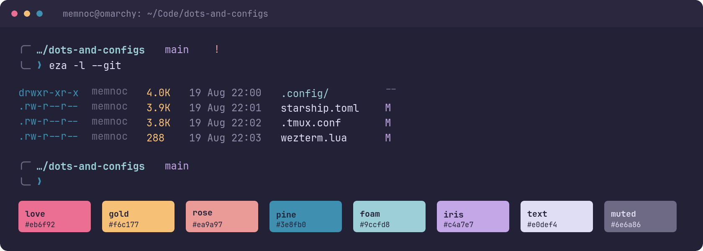
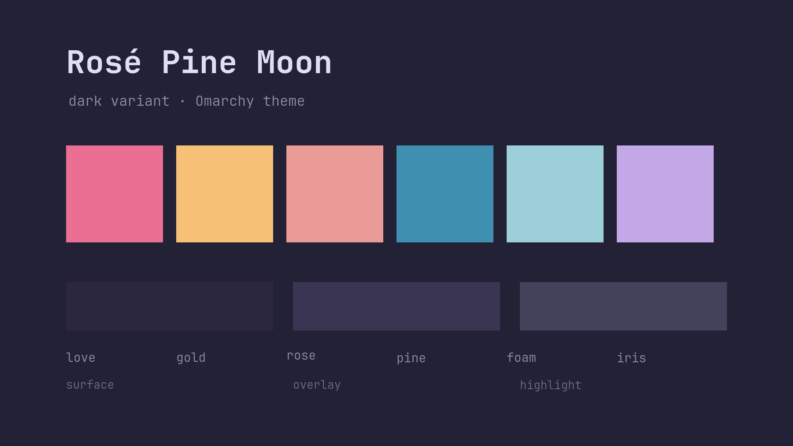

<p align="center">
    
    <h2 align="center">Rosé Pine Moon for Omarchy</h2>
</p>

The **Moon** variant of [Rosé Pine](https://rosepinetheme.com) as an
[Omarchy](https://omarchy.org) theme.

Omarchy ships a stock `rose-pine` theme, but it is the light **Dawn** variant.
This is the mid-dark **Moon** variant — same palette family, built for a dark
desktop.

## Install

```bash
omarchy theme install https://github.com/Memnoc/omarchy-rose-pine-moon-theme.git
```

Omarchy clones this into `~/.config/omarchy/themes/rose-pine-moon` and applies it
straight away. Afterwards:

```bash
omarchy theme set "Rose Pine Moon"
omarchy theme bg next          # cycle the wallpapers
```

## In use



## Palette



| role | hex | used for |
|------|-----|----------|
| base | `#232136` | background |
| surface | `#2a273f` | |
| overlay | `#393552` | elevated surfaces |
| muted | `#6e6a86` | dimmed text |
| subtle | `#908caa` | secondary text |
| text | `#e0def4` | foreground |
| love | `#eb6f92` | red |
| gold | `#f6c177` | yellow |
| rose | `#ea9a97` | cyan slot |
| pine | `#3e8fb0` | green slot |
| foam | `#9ccfd8` | blue slot, accent |
| iris | `#c4a7e7` | magenta |

The green/cyan/blue slots follow upstream Rosé Pine's terminal mapping
(`green→pine`, `cyan→rose`, `blue→foam`), which is why "green" renders as a
teal-blue. That is intentional and matches every other Rosé Pine terminal port.

`dark_background` and `darker_background` are derived from `base` at roughly
0.73× and 0.53×, the same steps Omarchy's other dark themes use. The key set
matches Omarchy 4's stock themes exactly.

## Wallpapers

Two are included, both official Rosé Pine Moon wallpapers from
[rose-pine/wallpapers](https://github.com/rose-pine/wallpapers) (CC0-1.0 — public
domain, used with credit as a courtesy rather than a requirement). Cycle them with
`omarchy theme bg next`.

| | |
|---|---|
|  |  |
| `1-leafy-moon.jpg` | `2-block-wave-moon.png` |

Add your own to `~/.config/omarchy/backgrounds/rose-pine-moon/` without touching
the theme.

## What's included

| file | purpose |
|------|---------|
| `colors.toml` | the palette Omarchy templates into ~17 apps |
| `neovim.lua` | pulls `rose-pine/neovim` at priority 1000, sets `rose-pine-moon` |
| `vscode.json` | Rosé Pine Moon via the `mvllow.rose-pine` extension |
| `icons.theme` | `Yaru-purple` |
| `backgrounds/` | two official Rosé Pine Moon wallpapers |
| `preview.png` | palette card for the theme picker |
| `unlock.png`, `preview-unlock.png` | Plymouth boot logo and boot-screen preview |

There is deliberately no `chromium.theme`: Omarchy's dark themes ship none, and
Chromium picks a sensible dark frame on its own.

## Credits

- Palette: [Rosé Pine](https://rosepinetheme.com), used under its MIT licence.
  Rosé Pine distinguishes **official** themes (transferred into their GitHub
  org) from **community** themes (listed on their site, repo stays with the
  author). This port is neither, yet — it's not currently listed on
  rosepinetheme.com in either category. See their
  [Create a theme](https://rosepinetheme.com/create) guide if you'd like to
  build or submit one.
- Platform: [Omarchy](https://omarchy.org), whose theme framework (`colors.toml`
  templated into ~17 apps) this port fills in. Built following Omarchy's own
  [theming guide](https://omarchy.org/manual/making-your-own-theme/).
- `unlock.png` / `preview-unlock.png` are the Omarchy wordmark recoloured to this
  theme's accent, matching how the stock themes ship theirs.
- Wallpapers: `1-leafy-moon.jpg` by [fvrests](https://github.com/fvrests) and
  `2-block-wave-moon.png` by [ng-hai](https://github.com/ng-hai), both from
  [rose-pine/wallpapers](https://github.com/rose-pine/wallpapers) (CC0-1.0).

## Licence

MIT — see [LICENSE](LICENSE).
