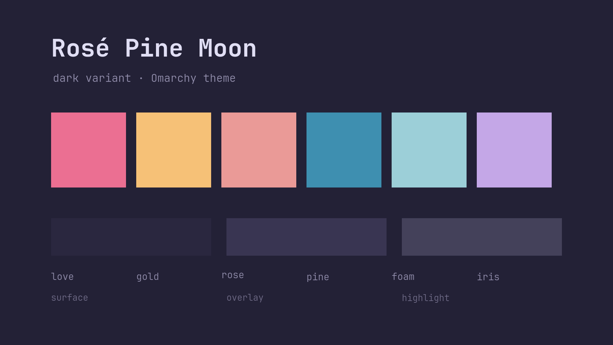

# Rosé Pine Moon for Omarchy

The **Moon** variant of [Rosé Pine](https://rosepinetheme.com) as an
[Omarchy](https://omarchy.org) theme.

Omarchy ships a stock `rose-pine` theme, but it is the light **Dawn** variant.
This is the mid-dark **Moon** variant — the same palette family, but built for a
dark desktop.



## Install

```bash
omarchy theme install https://github.com/Memnoc/omarchy-rose-pine-moon-theme.git
```

Omarchy clones this into `~/.config/omarchy/themes/rose-pine-moon` and applies it
straight away. To switch back and forth afterwards:

```bash
omarchy theme set "Rose Pine Moon"
```

## Palette

| role | hex | used for |
|------|-----|----------|
| base | `#232136` | background |
| surface | `#2a273f` | |
| overlay | `#393552` | elevated surfaces |
| muted | `#6e6a86` | dimmed text |
| subtle | `#908caa` | secondary text |
| text | `#e0def4` | foreground |
| love | `#eb6f92` | red |
| gold | `#f6c177` | yellow |
| rose | `#ea9a97` | cyan slot |
| pine | `#3e8fb0` | green slot |
| foam | `#9ccfd8` | blue slot, accent |
| iris | `#c4a7e7` | magenta |

The green/cyan/blue slots follow upstream Rosé Pine's terminal mapping
(`green→pine`, `cyan→rose`, `blue→foam`), which is why "green" renders as a
teal-blue. That is intentional and matches every other Rosé Pine terminal port.

`dark_background` and `darker_background` are derived from `base` at roughly
0.73× and 0.53×, the same steps Omarchy's other dark themes use.

## What's included

| file | purpose |
|------|---------|
| `colors.toml` | the palette Omarchy templates into ~17 apps |
| `neovim.lua` | pulls `rose-pine/neovim`, sets `rose-pine-moon` |
| `vscode.json` | Rosé Pine Moon via the `mvllow.rose-pine` extension |
| `icons.theme` | `Yaru-purple` |
| `backgrounds/` | three wallpapers (solid, gradient, radial) |
| `preview.png` | palette card for the theme picker |
| `unlock.png`, `preview-unlock.png` | Plymouth boot logo and boot-screen preview |

There is deliberately no `chromium.theme`: Omarchy's dark themes ship none, and
Chromium picks a sensible dark frame on its own.

The backgrounds are simple generated gradients in the Moon palette rather than
artwork — drop anything you prefer into `backgrounds/`, or add your own without
touching the theme at `~/.config/omarchy/backgrounds/rose-pine-moon/`.

## Credits

- Palette: [Rosé Pine](https://rosepinetheme.com), used under its MIT licence.
- `unlock.png` / `preview-unlock.png` are the Omarchy wordmark recoloured to this
  theme's accent, matching how the stock themes ship theirs.

## Licence

MIT — see [LICENSE](LICENSE).
